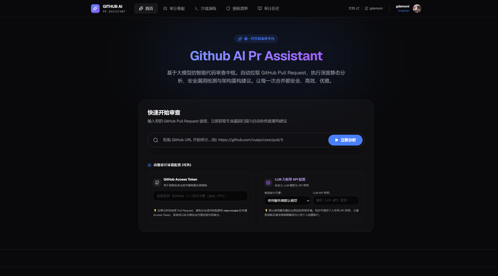
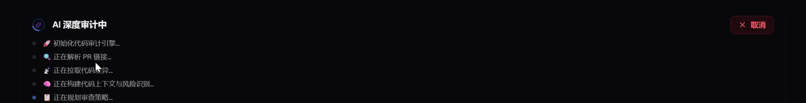
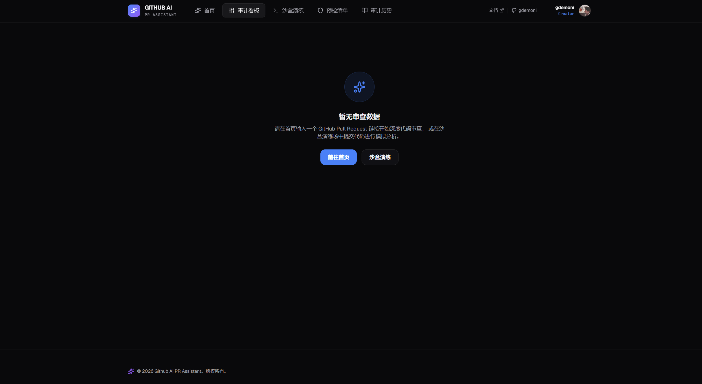
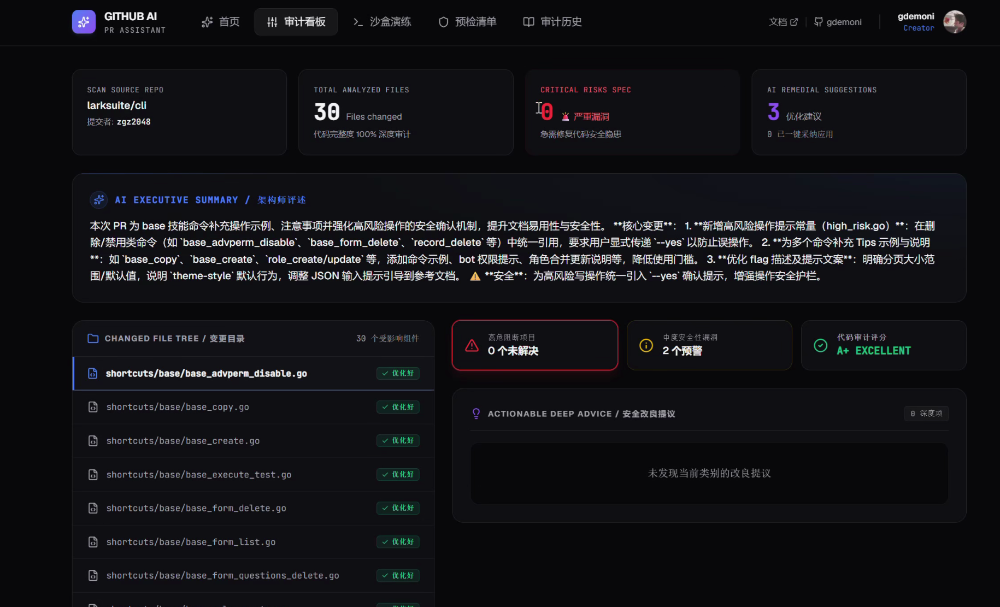
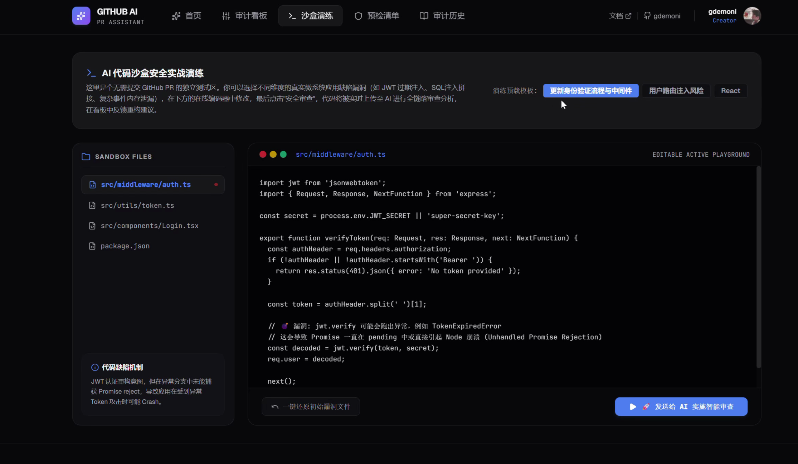

# AI PR Review Assistant

> 基于 AI Agent 的智能 Pull Request 代码审查助手 — 让每一次合并都安全、高效、优雅。


---

## 项目简介

**AI PR Review Assistant**（代号 CodePulse AI）是一个基于大语言模型与 Multi-Agent 工作流的智能 PR 代码审查系统。开发者只需粘贴一个 GitHub Pull Request 链接，系统即可自动完成 **PR 解析 → Diff 获取 → 风险文件筛选 → 多 Agent 并发分析 → 评分聚合 → 报告生成** 的全流程，在数秒内输出包含安全漏洞分析、性能瓶颈诊断、代码质量评分及重构建议的专业审查报告。

### 项目背景

在软件开发的 Code Review 环节中，开发者普遍面临以下痛点：

| 痛点 | 影响 |
|------|------|
| PR 变更内容多，Review 成本高 | 大型 PR 动辄数十个文件，人力逐行审查耗时巨大 |
| 容易遗漏高风险代码 | 安全漏洞（SQL 注入、XSS、凭证泄露）隐藏在大量变更中难以发现 |
| 缺乏代码上下文导致分析不准确 | 仅看 Diff 无法理解文件间的依赖关系和调用链 |
| 人工 Review 质量不稳定 | 受 reviewer 经验、精力影响，不同人审查标准参差不齐 |

针对上述问题，本系统利用 **AI Agent + LangGraph 工作流引擎**，实现了自动化、标准化、深层次的代码审查能力，显著降低 Review 成本并提升代码质量。

---

## 在线体验

**GitHub 仓库**：[gdemoni/AI-PR-Review-Assistant](https://github.com/gdemoni/AI-PR-Review-Assistant)

---

## 核心功能

### 1. GitHub PR 一键解析

- 支持输入任意 GitHub 公开/私有仓库 PR 链接
- 自动提取 PR 标题、作者、仓库信息
- 自动拉取完整 Diff 与变更文件列表
- 支持沙盒演练模式（无需 PR 链接，直接提交代码）

### 2. 智能风险文件预筛选

- 基于 **敏感路径 + 关键词 + Diff 内容** 的三维匹配算法
- 零 LLM 成本，毫秒级完成筛选
- 覆盖安全、数据、IO、配置、权限等 20+ 风险维度
- 确保高风险文件获得深度分析，同时控制 LLM 调用成本

### 3. GitHub 上下文增强分析

- 调用 GitHub Contents API 获取风险文件的完整源代码
- 自动提取 **import 语句** 和 **函数定义** 作为分析上下文
- 支持 Python/JavaScript/TypeScript/Go/Java/C#/PHP 等多语言
- 显著提升 AI 对代码结构和依赖关系的理解准确性

### 4. Multi-Agent 并发审查

- **Summary Agent**：生成 PR 业务目的与核心变更摘要
- **Comprehensive Agent**：三合一深度审查（安全 + 性能 + 质量）
- **Critic Agent**：自检修正，评估分析置信度，必要时触发重跑
- **Aggregator**：合并去重、排序评分、输出 verdict

### 5. AI 审查报告与一键修复

- 综合评分（0-100）与 verdict（safe / needs_work / blocked）
- 安全风险高亮与等级标注
- 缺陷代码与修复方案逐行对比
- **一键重构**：在界面中直接应用 AI 建议的修复代码

### 6. 流式实时反馈与取消

- SSE 流式接口，实时推送每个节点的执行进度
- 前端实时展示审查进度条与日志
- 支持用户主动取消正在进行的审查

---

## 系统架构设计

```
┌──────────────────────────────────────────────────────────────┐
│                      Frontend (React SPA)                      │
│   React 19 + TypeScript + TailwindCSS 4 + Vite 6              │
│   ┌─────────┐ ┌──────────┐ ┌─────────┐ ┌──────────┐         │
│   │ 首页    │ │ 审计看板 │ │ 沙盒演练 │ │ 审计历史 │         │
│   └────┬────┘ └────┬─────┘ └────┬────┘ └────┬─────┘         │
│        └───────────┴──────┬─────┴───────────┘                │
│                    HTTP / SSE                                 │
└───────────────────────────┼──────────────────────────────────┘
                            │ POST /api/analyze-pr/stream
                            ▼
┌──────────────────────────────────────────────────────────────┐
│                    Backend (FastAPI)                           │
│   ┌──────────────────────────────────────────────────────┐   │
│   │              LangGraph Workflow                        │   │
│   │  ┌──────────┐ → ┌───────────┐ → ┌─────────────┐      │   │
│   │  │ parse_pr │   │ fetch_diff│   │context_build│      │   │
│   │  └──────────┘   └───────────┘   └──────┬──────┘      │   │
│   │                                        ▼              │   │
│   │                                   ┌──────────┐        │   │
│   │                                   │  planner  │        │   │
│   │                                   └─────┬────┘        │   │
│   │                            ┌────────────┼────┐         │   │
│   │                            ▼            ▼    ▼        │   │
│   │                     ┌──────────┐ ┌────────────┐        │   │
│   │                     │Summary   │ │Comprehensive│        │   │
│   │                     │Agent     │ │Agent(三合一)│        │   │
│   │                     └─────┬────┘ └──────┬─────┘        │   │
│   │                           └──────┬──────┘              │   │
│   │                                  ▼                     │   │
│   │                           ┌──────────┐                 │   │
│   │                           │  Critic  │                 │   │
│   │                           │  Agent   │                 │   │
│   │                           └────┬─────┘                 │   │
│   │                     need_rerun?│                       │   │
│   │                    ┌───────────┴──────────┐            │   │
│   │                    ▼                      ▼            │   │
│   │             ┌──────────┐          ┌──────────┐         │   │
│   │             │loop_gate │          │aggregator│         │   │
│   │             │(round+1) │          └────┬─────┘         │   │
│   │             └────┬─────┘               ▼               │   │
│   │                  │(rerun)         ┌──────────┐          │   │
│   │                  └──────────────→ │  report  │          │   │
│   │                                    └──────────┘        │   │
│   └──────────────────────────────────────────────────────┘  │
│                     ▲                                       │
│          ┌──────────┴──────────┐                            │
│          ▼                     ▼                             │
│   ┌─────────────┐    ┌────────────────┐                      │
│   │  GitHub API  │    │ Multi-Provider │                      │
│   │  REST Client │    │   LLM Adapter  │                      │
│   └─────────────┘    └────────────────┘                      │
│         │                  │                                  │
│         ▼                  ▼                                  │
│   GitHub.com         DeepSeek/Qwen/GLM/                       │
│                      Kimi/OpenAI                              │
└──────────────────────────────────────────────────────────────┘
```

### 前端技术栈

| 技术 | 用途 |
|------|------|
| React 19 | 组件化 UI 框架 |
| TypeScript | 类型安全的开发语言 |
| TailwindCSS 4 | 原子化 CSS 样式框架 |
| Vite 6 | 极速开发构建工具 |
| Lucide React | 图标组件库 |

### 后端技术栈

| 技术 | 用途 |
|------|------|
| Python 3.11+ | 后端开发语言 |
| FastAPI | 高性能异步 Web 框架 |
| LangGraph | Agent 工作流编排引擎 |
| httpx | 异步 HTTP 客户端（GitHub API 调用） |
| OpenAI SDK | 统一 LLM 调用接口 |
| Pydantic | 数据模型验证 |
| Uvicorn | ASGI 服务器 |

### LLM 供应商适配

系统原生支持 **5 家主流 LLM 供应商**，通过统一适配层实现无缝切换：

- **DeepSeek**（默认，DeepSeek-V4 Pro / V3 / R1）
- **阿里通义千问**（Qwen-Plus / Qwen-Max / Qwen-Turbo）
- **智谱 GLM**（GLM-4-Flash / GLM-4-Plus / GLM-4-Air）
- **月之暗面 Kimi**（moonshot-v1-8k / 32k / 128k）
- **OpenAI**（GPT-4o）

前端选择模型时，系统自动通过模型名关键词推断供应商（如 `qwen-max` → Qwen API），确保模型名与 API 端点精确匹配。

---

## AI Agent 工作流

### 工作流总览

本系统基于 **LangGraph StateGraph** 构建了 10 个节点的有向图工作流，涵盖串行、并发、条件路由与迭代回环四种执行模式。

### 阶段一：预处理阶段（串行）

| 节点 | 功能 | 关键实现 |
|------|------|---------|
| `parse_pr` | 解析 PR URL，提取 owner/repo/number | 正则匹配，调用 GitHub Pulls API |
| `fetch_diff` | 获取 PR 变更文件列表与 Diff 内容 | 调用 Pulls Files API + Raw File API |
| `context_builder` | 风险文件筛选 + GitHub 上下文获取 | 零 LLM 成本的关键词匹配 + Contents API |
| `planner` | 制定审查策略 | 首轮固定策略；复查轮基于 Critic 反馈动态规划 |

### 阶段二：并发审查阶段（Fan-out）

```
         planner
        ┌───┴───┐
        ▼       ▼
    Summary   Comprehensive
    Agent      Agent (三合一)
 (仅首轮)
```

- **Summary Agent**：生成 PR 业务目的与核心变更摘要（仅首轮执行，重跑时自动跳过）
- **Comprehensive Agent**：对每个风险文件执行单次 LLM 调用，同时输出安全风险、性能问题、代码质量三个维度的分析结果

### 阶段三：自检与迭代阶段（Critic Loop）

```
    Summary + Comprehensive
              ▼
          Critic Agent
              │
    ┌─────────┴─────────┐
    ▼                   ▼
 confidence≥0.5    confidence<0.5
     → 聚合         且 round<2
                         │
                    loop_gate (round+1)
                         │
                    planner (基于Critic反馈重规划)
                         │
                    Comprehensive Agent (带修正提示重跑)
```

- **Critic Agent** 独立评估分析置信度（0-1 区间）
- 置信度 ≥ 0.5 或已达最大轮数 → 进入聚合阶段
- 置信度 < 0.5 且未达最大轮数 → loop_gate 递增轮次 → planner 基于 Critic 反馈重新规划 → Comprehensive Agent 携带修正提示重跑

### 阶段四：聚合与报告阶段

- **Aggregator**：合并三个维度的分析结果，去重排序，计算综合评分（0-100）与 verdict
- **Report Generator**：生成专业 Markdown 格式审查报告

---

## 上下文获取与风险识别策略

### 风险文件预筛选算法

系统采用 **三维度匹配算法**，完全基于规则匹配，零 LLM 成本：

```python
RISKY_KEYWORDS = [
    # 安全相关: auth, login, password, token, secret, jwt, oauth...
    # 数据相关: sql, query, database, db, mongo, redis, cache...
    # IO 相关: input, request, response, upload, download, file...
    # 配置相关: config, permission, role, admin, settings...
    # 敏感领域: payment, billing, transaction, encrypt, decrypt...
]
RISKY_PATHS = [
    r"(^|/)auth/", r"(^|/)security/", r"(^|/)api/", r"(^|/)admin/",
    r"(^|/)config/", r"(^|/)database/", r"(^|/)middleware/",
    r"\.sql$", r"\.env",
]
```

筛选逻辑：

1. **文件名匹配**：检查文件名是否包含风险关键词（不区分大小写）
2. **路径模式匹配**：检查文件路径是否匹配风险目录模式（正则匹配）
3. **Diff 内容匹配**：检查代码变更内容是否包含风险关键词

若筛选后无风险文件命中，采用保守策略自动将前 5 个变更文件纳入分析，防止漏审。

### GitHub 上下文获取

对筛选出的风险文件，系统进一步调用 GitHub Contents API 获取完整源代码，并执行多语言结构化解析：

- **Import 提取**：Python（`import`/`from...import`）、JavaScript/TypeScript（`require`、ES6 `import`）、PHP（`use`）、Go（`package`）等多语言支持
- **函数定义提取**：Python（`def`）、JavaScript/TypeScript（`function`）、Java/C#（访问修饰符 + 方法签名）、Go（`func`）等多语言支持

提取的 imports + funcs 作为结构化上下文注入 Comprehensive Agent 的 prompt，帮助 AI 理解代码结构和模块依赖关系，显著提升分析准确性。

### 错误处理与异常透传

系统实现了精细化的 GitHub API 异常处理，根据 HTTP 状态码自动区分错误类型并向用户展示精准提示：

| HTTP 状态码 | 错误类型 | 用户提示 |
|-------------|---------|---------|
| 404 | 仓库/PR 不存在或私有仓库 | 提醒检查链接或填写 Token |
| 401 | Token 无效或已过期 | 提示更新 GitHub Access Token |
| 403 | Token 权限不足 | 提示需要 repo scope |

---

## 模型选择原因

### 为什么采用 Multi-Agent 架构？

| 维度 | 单 Agent 全量分析 | Multi-Agent 并发分析（本方案） |
|------|------------------|-------------------------------|
| 关注点分离 | 一个 prompt 承载所有要求，容易相互干扰 | 每个 Agent 专注一个维度，prompt 更精准 |
| 准确性 | 易遗漏子维度问题 | 各维度深度分析后聚合，互为补充 |
| 可扩展性 | 新增维度需重构整个 prompt | 新增 Agent 节点即可，不影响现有流程 |
| 迭代优化 | 无法定向修正某个维度 | Critic 可精确定位需要重跑的 Agent 和维度 |
| 响应速度 | 串行执行 | 并发执行，总耗时 = 最慢的 Agent |

### 为什么只对风险文件进行上下文分析？

**核心考量：平衡准确率与响应速度**

- 一个大型 PR 可能包含 30+ 个变更文件，对每个文件都拉取完整源码并执行 LLM 分析将导致极高的 API 调用成本和漫长的等待时间
- 实际代码审查经验表明，80% 的严重问题集中在 20% 的高风险文件中（符合帕累托分布）
- 通过三维预筛选算法（纯规则匹配，毫秒级完成），精准定位高风险文件，仅对这些文件进行深度上下文获取与 LLM 分析

### 如何平衡准确率与响应速度？

1. **预处理阶段零 LLM 调用**：URL 解析、Diff 获取、风险筛选全部通过规则匹配和 GitHub API 完成，不消耗 LLM 额度
2. **三合一 Comprehensive Agent**：每个文件仅需 1 次 LLM 调用，同时完成安全、性能、质量三维分析（原方案需 3 次调用 → 1 次）
3. **可控的 Critic 迭代**：默认单轮审查（max_rounds=1），仅在 Critic 判定置信度不足时启用第二轮
4. **流式 SSE 反馈**：前端实时展示每个节点执行进度，用户无需等待完全结束即可感知进展

### 如何降低误报和漏报？

1. **GitHub 上下文增强**：完整源码 + imports + funcs 为 AI 提供代码结构的全景理解，降低因上下文缺失导致的误判
2. **Critic 自检机制**：独立评估 Agent 输出的一致性，标记置信度低的发现
3. **可选迭代复查**：Critic 判定需要重跑时，携带上一轮反馈重新分析，修正遗漏或误报
4. **聚合去重**：最终评分前合并各维度结果，消除重复发现
5. **保守的风险文件策略**：若风险筛选无命中，自动兜底取前 5 个文件，防止漏审

---

## 创新点

### 1. 风险文件预筛选

不同于传统方案将全部代码直接送入 LLM 分析，本系统实现了 **三维度规则匹配 + 零 LLM 成本** 的预筛选机制。该机制能在毫秒级从数十个变更文件中精准定位高风险文件，显著降低 LLM 调用成本的同时确保关键代码获得深度分析。这是一个典型的 **"先做减法再做深度"** 策略，在工程实践中证明极为有效。

### 2. Multi-Agent 并发执行

基于 LangGraph StateGraph 构建的 **10 节点有向图工作流**，支持串行、并发、条件路由与迭代回环四种执行模式。Comprehensive Agent 将安全、性能、质量三维分析合并为单次 LLM 调用，在保证分析深度的同时最大化并发效率。Critic Loop 机制实现了 Agent 输出的自检与修正，形成完整的 **分析 → 评估 → 重跑 → 聚合** 闭环。

### 3. GitHub 上下文增强分析

系统不仅仅是拉取 PR Diff 数据，更进一步通过 GitHub Contents API 获取风险文件的 **完整源代码**，并利用多语言正则引擎自动提取 import 语句和函数定义。这些结构化上下文信息显著提升了 AI 对代码结构、依赖关系和调用链的理解能力，从而产生更精准的分析结果。

### 4. AI 自动生成 Review 建议与一键修复

系统不仅发现问题，还提供 **可操作的修复方案**。Comprehensive Agent 输出的代码质量建议包含 `originalCode`（缺陷代码）和 `revisedCode`（修复方案），前端以 Old/New 对比方式清晰展示差异。用户只需点击 **"一键重构"** 按钮，即可将 AI 建议的修复代码应用到本地沙盒，实现从发现问题到解决问题的完整闭环。

### 5. SSE 流式实时反馈与取消机制

后端采用 **Server-Sent Events** 实时推送每个节点的执行状态，前端动态展示分步进度日志。同时支持用户通过 `AbortController` 主动取消正在进行的审查，后端检测到客户端断开后立即停止工作流执行，避免资源浪费。前端取消按钮可在审查任意阶段触发，极大地提升了用户体验。

### 6. 多供应商智能路由

前端选择模型时，后端通过模型名关键词自动推断对应供应商（如 `qwen-max` → 通义千问 API，`gpt-4o` → OpenAI API），无需用户手动选择供应商。同时支持自定义 API Key 覆盖环境变量，实现 BYOK（Bring Your Own Key）的灵活部署模式。

---

## 开发过程

### 分支管理策略

本项目采用 **Git Flow 简化版** 分支管理策略：

| 分支 | 用途 |
|------|------|
| `main` | 主分支，保持稳定可发布状态 |
| `backend` | 后端功能开发分支 |
| `frontend` | 前端功能开发分支 |
| `prototype` | 原型快速迭代分支（项目早期使用） |

### PR 开发流程

1. 从 `main` 创建功能分支（如 `backend` / `frontend`）
2. 在功能分支上独立迭代开发，通过 `Merge` 保持与其他分支同步
3. 功能分支开发完成 → 提 PR → 代码审查 → squash merge 至 `main`
4. 合并后删除功能分支，保持分支结构整洁

### Commit 记录规范

采用 **中文描述 + 语义化前缀** 的 commit 风格：

| 类型 | 示例 |
|------|------|
| 功能新增 | `实现 PR 审查工作流接口` |
| 功能优化 | `优化 LangGraph 架构，合并多Agent为Comprehensive Agent` |
| Bug 修复 | `修复 comprehensive_node 中风险文件选择逻辑` |
| 架构重构 | `重构 LangGraph 节点扩展至 11 个处理节点` |
| 代码清理 | `chore: 清理 __pycache__ 缓存文件，解决合并冲突` |
| 合并操作 | `Merge pull request #12 from gdemoni/frontend` |

### 关键开发节点

| 时间 | 里程碑 |
|------|--------|
| 2025-05-21 | 项目初始化与原型搭建 |
| 2025-05-22 | 前后端分离架构重构 |
| 2025-05-25 | PR 审查工作流接口实现 |
| 2025-05-26 | GitHub API 集成与风险文件筛选 |
| 2025-05-27 | LangGraph Multi-Agent 迭代反馈环 |
| 2025-05-28 | 四 Agent 并发审查流水线 |
| 2025-05-29 | Comprehensive Agent 三合一优化（3次 → 1次 LLM 调用） |
| 2025-05-30 | SSE 流式接口 + 前端取消功能 |
| 2025-05-31 | 节点异常处理与错误透传优化 |

---

## 项目展示

### 演示视频

> 通过网盘分享的文件：github_pr_assistant演示视频
> 链接: https://pan.baidu.com/s/1Es7a5IPgBOZuH9su1u45ZA 提取码: 2j7w

### 首页



### AI 深度审计



### 审计看板



### 风险分析详情



### 沙盒演练



---

## 项目亮点与效果

### 技术亮点

1. **全链路自动化**：从 PR 链接输入到报告生成，全流程无需人工介入
2. **灵活模型适配**：原生支持 5 家主流 LLM 供应商，前端选模型时自动推断供应商
3. **可自愈的审查流程**：Critic Loop 机制实现输出质量的自检与修正
4. **极致的成本控制**：预筛选零 LLM 调用 + 三合一 Agent（3→1）+ 默认单轮策略
5. **实时交互体验**：SSE 流式推送节点进度 + 支持用户主动取消

### 核心指标

| 指标 | 表现 |
|------|------|
| 单次审查平均耗时 | 5-15 秒（取决于文件数和 LLM 响应速度）|
| 风险文件筛选耗时 | 毫秒级 |
| 支持编程语言 | 6+（Python, JS/TS, Go, Java, C#, PHP）|
| 支持 LLM 供应商 | 5 家（DeepSeek, Qwen, GLM, Moonshot, OpenAI）|
| 分析维度 | 3（安全、性能、质量）+ 1（综合摘要）|
| LLM 调用优化 | 从 3 次/文件 降至 1 次/文件（三合一）|
| 错误类型识别 | 4 种（404/401/403/通用 + 精准提示）|

---

## 未来优化方向

### 1. CLI 命令行工具

将系统从 Web 应用重构为 **跨平台 CLI 命令行工具**，打造成面向开发者的全能 GitHub AI 助手。核心设计思路：

```
gh-ai pr review <pr-url>          # PR 代码审查（当前核心能力 CLI 化）
gh-ai pr summary <pr-url>         # 快速 PR 摘要
gh-ai issue analyze <issue-url>   # Issue 分析与修复建议
gh-ai repo scan <repo-path>       # 仓库全量代码扫描
gh-ai commit review <commit-sha>  # 单次 Commit 审查
gh-ai workflow suggest            # CI/CD 工作流优化建议
```

**CLI 优势**：
- **去浏览器化**：开发者终端即可完成所有操作，无需离开编辑器
- **Pipeline 集成**：可直接嵌入 CI/CD 脚本，实现自动化代码门禁
- **Git Hooks 集成**：结合 `pre-commit` / `prepare-commit-msg` 等 Git Hooks，在代码提交前自动触发增量审查
- **批量处理**：支持批量审查多个 PR 或全仓库扫描，输出结构化 JSON 报告
- **低资源占用**：相比 Web 应用，CLI 模式无需前端资源，启动即用

### 2. 集成更多 GitHub 操作

从纯 "Review" 工具升级为 **GitHub AI 全能助手**，覆盖 GitHub 全流程：

| 功能 | 说明 |
|------|------|
| PR 自动创建 | AI 根据代码变更自动生成 PR 标题、描述与变更说明 |
| 智能 Commit 生成 | 分析代码差异，一键生成符合规范的 Commit Message |
| Issue 自动回复 | 根据 Issue 内容自动分析根因并给出修复建议 |
| Code Review 自动回写 | 审查结果自动提交为 GitHub PR Review Comments |
| 自动 Merge 决策 | 根据评分和测试状态，自动判断是否可以安全合并 |
| Release Notes 生成 | 基于 PR 历史自动生成版本发布说明 |

### 3. 本地化知识库与 RAG

构建本地向量知识库，持久化存储项目的代码结构、历史审查记录、团队编码规范等。每次审查时通过语义检索召回相关知识作为 LLM 上下文，让 AI 审查结果更贴合项目自身的技术栈和编码风格。

### 4. 更智能的上下文理解

- **Call Graph 静态分析**：基于 AST 的调用图分析，追踪函数间的调用链和数据流
- **仓库级全文索引**：支持跨文件搜索和引用追踪，理解全局代码结构
- **增量 Diff 分析**：仅分析变更行及其周边上下文，减少 LLM Token 消耗

### 5. MCP 协议生态集成

通过 Model Context Protocol 将 CLI 工具的能力暴露给更多生态：
- **IDE 集成**：VS Code / JetBrains 插件中直接调用 CLI 能力
- **CI/CD 集成**：GitHub Actions / GitLab CI 流水线中作为 Step 执行
- **编辑器内联**：在编辑器中选中代码即可触发 AI 审查

---

## 本地运行

### 前置要求

- Python 3.11+
- Node.js 18+
- 一个 LLM API Key（支持 DeepSeek / Qwen / GLM / Kimi / OpenAI 中任意一家）
- （可选）GitHub Personal Access Token（分析私有仓库时需要）

### 后端启动

```bash
# 1. 进入后端目录
cd backend

# 2. 安装依赖
pip install -r requirements.txt

# 3. 配置环境变量
cp .env.example .env
# 编辑 .env，填入 LLM API Key 和其他配置

# 4. 启动服务（开发模式，支持热重载）
python app/main.py
# 服务运行在 http://localhost:8000
```

### 前端启动

```bash
# 1. 进入前端目录
cd frontend

# 2. 安装依赖
npm install

# 3. 启动开发服务器
npm run dev
# 服务运行在 http://localhost:5173
```

### .env 配置参考

```bash
# LLM 供应商（deepseek / qwen / zhipu / moonshot / openai）
LLM_PROVIDER=deepseek

# DeepSeek API Key
DEEPSEEK_API_KEY=sk-your-key-here

# 可选：默认模型（不设置则使用供应商默认模型）
LLM_MODEL=deepseek-v4-pro

# 可选：GitHub Token（读取私有仓库时需要）
GITHUB_TOKEN=ghp_your-token-here

# 可选：服务端口（默认 8000）
PORT=8000
```

### 访问系统

打开浏览器访问 `http://localhost:5173`，输入 GitHub PR 链接或使用沙盒演练模式即可开始使用。

---

## 项目结构

```
AI-PR-Review-Assistant/
├── backend/                          # FastAPI 后端
│   ├── app/
│   │   ├── __init__.py
│   │   ├── main.py                   # FastAPI 入口，CORS 配置
│   │   ├── router.py                 # API 路由（JSON + SSE 流式）
│   │   └── schemas.py                # Pydantic 数据模型
│   ├── graph/
│   │   ├── __init__.py
│   │   ├── workflow.py               # LangGraph 工作流定义与编译
│   │   ├── nodes.py                  # 10 个处理节点实现
│   │   ├── state.py                  # 全局状态类型定义
│   │   ├── prompts.py                # LLM Prompt 模板
│   │   └── tool/
│   │       ├── github.py             # GitHub API 调用 + 风险筛选
│   │       └── llm.py                # 多供应商 LLM 适配层
│   ├── .env                          # 环境变量（不提交）
│   ├── .env.example                  # 环境变量模板
│   ├── langgraph.json                # LangGraph CLI 配置
│   └── requirements.txt              # Python 依赖
├── frontend/                         # React 前端
│   ├── src/
│   │   ├── App.tsx                   # 主应用组件（单页 SPA）
│   │   ├── main.tsx                  # 入口文件
│   │   ├── index.css                 # 全局样式（TailwindCSS）
│   │   ├── types.ts                  # TypeScript 类型定义
│   │   └── data/
│   │       └── templates.ts          # 沙盒演练预置模板
│   ├── index.html                    # HTML 入口
│   ├── package.json                  # Node 依赖
│   ├── vite.config.ts                # Vite 构建配置
│   └── tsconfig.json                 # TypeScript 配置
├── assets/                           # 静态资源目录
├── metadata.json                     # 项目元数据
└── README.md                         # 项目文档（本文件）
```

---

## 总结

**AI PR Review Assistant** 是一个基于 AI Agent 的智能代码审查系统，以 **"自动化、标准化、智能化"** 为设计理念，系统性地解决了开发者在 Code Review 中的效率与质量问题。

在 **架构设计** 层面，系统采用 FastAPI + LangGraph 后端与 React + TypeScript + TailwindCSS 前端的全栈架构，通过 SSE 流式接口实现前后端实时交互。核心工作流基于 LangGraph StateGraph 构建了 10 节点的有向图，支持串行、并发、条件路由与迭代回环四种执行模式。

在 **AI Agent 设计** 层面，系统采用 Summary + Comprehensive（安全/性能/质量三合一）+ Critic + Aggregator 的多 Agent 架构，实现了关注点分离、深度分析与自检修正的完整闭环。通过三维度风险预筛选和三合一 Agent 的创新设计，在保证分析质量的同时将 LLM 调用成本降至最低。

在 **工程实践** 层面，系统实现了精细化的 GitHub API 异常处理（4 种错误类型精准提示）、多供应商 LLM 智能路由（支持 5 家供应商无缝切换）、以及 SSE 流式推送 + 用户取消机制，展现了扎实的工程能力。

未来，系统将持续向 Call Graph 静态分析、仓库级 RAG 检索、MCP 协议集成和 GitHub Review 自动回写等方向演进，打造更智能、更全面的下一代代码审查基础设施。

---

> **作者**：gdemoni
> **技术栈**：React 19 + TypeScript + FastAPI + LangGraph + LLM + GitHub API
> **开源协议**：MIT
